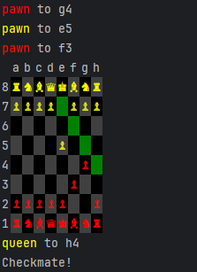

# Chess

Java implementation of console chess, with colors.

This was written as an example of object oriented programming.  ChessPiece is extended to create
each piece, and the board is a 2D array of ChessPiece objects.  This way the custom behavior of each
piece can be implemented in the class that represents it, and shared behavior can be implemented in the
ChessPiece class.

Does not include en-passant or castling at this time.

